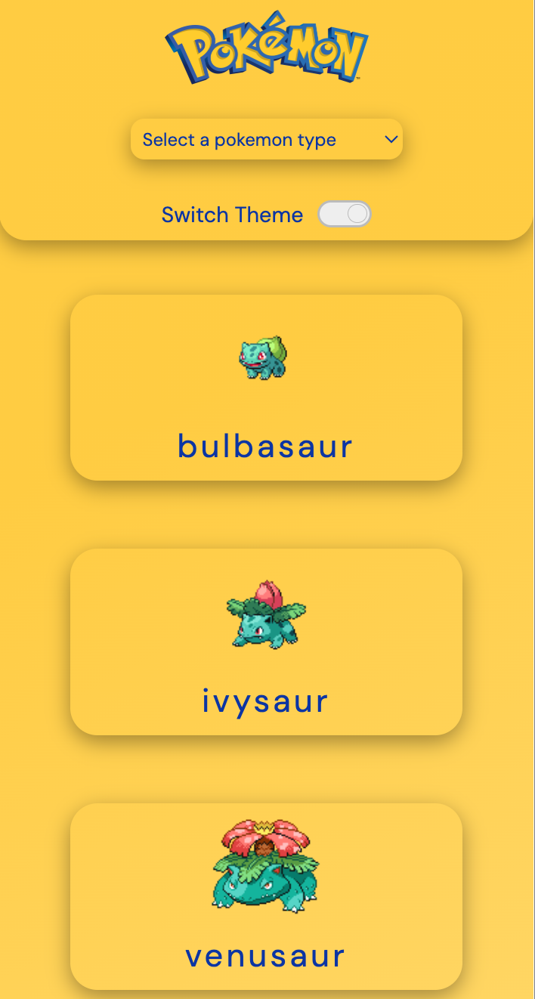
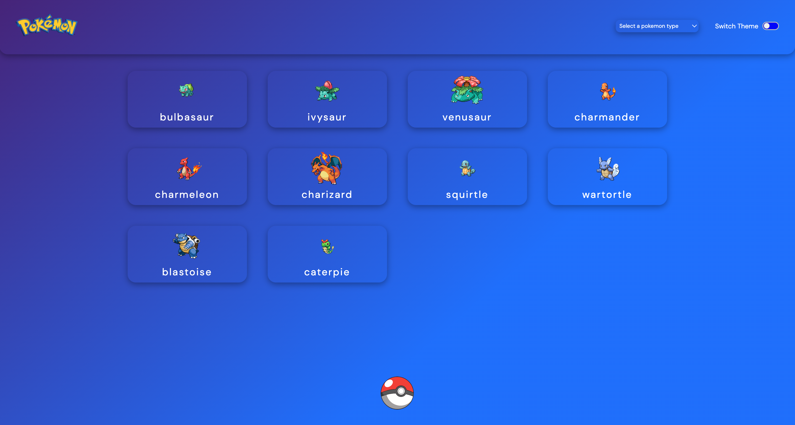

# Pokédex API
# Pokedex Api

## Tabela de Conteúdos
 - [O Site](#O-site)
 - [Capturas de Tela](#Capturas-de-tela)
 - [Funcionalidades](#functionalidades)
 - [Destaques do Processo](#Destaques-do-processo)

 - [Desenvolvido com](#Desenvolvido-com)
 - [Link](#Link)
 - [Autor](#Link)

### O Site
Um site que disponibiliza uma lista de cartas de Pokémon. Um guia que permite aos fãs aprender mais sobre os Pokémon e suas especificidades, além de introduzir o mundo Pokémon para aqueles que ainda não estão familiarizados com ele.

### Screenshot

### Funcionalidades
Cada card pode ser clicado para acessar uma página com informações mais específicas e detalhadas sobre o Pokémon. Ao clicar na Poké Bola, o usuário pode carregar mais cartas de Pokémon (10 por clique). O usuário também pode filtrar os Pokémon por tipo usando a barra de seleção e alterar o tema de cores do site clicando no botão de alternância de tema.

### Ferramentas
O site foi construído principalmente usando React.js, criando um ambiente mais dinâmico e fluido. Todas as informações necessárias foram obtidas por meio do Axios a partir da PokéAPI. A biblioteca React Router DOM foi utilizada para criar rotas, permitindo uma navegação suave para a página individual de cada Pokémon. A maioria dos estilos foi implementada usando a biblioteca Styled Components, tornando a estrutura do código mais organizada e facilitando futuras manutenções. A Context API foi usada para criar dois temas diferentes para o site, permitindo que o usuário escolha aquele que melhor se adapta às suas preferências.

### Destaques do Processo
O projeto foi desafiador. A PokéAPI fornece uma grande quantidade de informações, então, durante a fase de planejamento, foi extremamente importante explorar a API e filtrar e mapear especificamente os dados necessários. Também pesquisei referências para criar o layout e estudei a biblioteca Styled Components para transformar minha ideia em realidade.

A parte mais difícil foi filtrar os Pokémon por tipo. Inicialmente, tentei usar um campo de entrada de texto, mas isso exigia que os usuários já conhecessem os tipos de Pokémon, então mudei para uma barra de seleção. Criar uma estrutura dinâmica que renderizasse apenas os Pokémon de um tipo específico foi desafiador, mas o resultado final foi muito satisfatório.

### Desenvolvido com
- HTML 5
- CSS 3
- React JS

- JSON
- API
- Git/GitHub

### Link
https://quest-react-avancado-lh25af2h1-rafaels-projects-3b81a1b9.vercel.app

### Autor
Rafael Gevu

# Pokedex Api
## Table of contents
  - [The Website](#The-Website)
  - [Screenshots](#screenshots)
  - [Functionalities](#Functionalities)
  - [Process Highlights](#Process-Highlights)
  - [Built with](#built-with)
  -[Link](#Link)
  - [Author](#author)
  
### The Website
A website that provides a list of Pokémon cards. A guide that allows fans to learn more about Pokémon and their specificities while also introducing the Pokémon world to those who are not yet familiar with it.

### Screenshot

### Functionalities
 Each card can be clicked to access a page with more specific and detailed information about the Pokémon. By clicking the Poké Ball, the client can load more Pokémon cards (10 per click). The client can also filter Pokémon by type using the select bar and change the website's color theme by clicking the theme toggler button.

### Tools
The website was built primarily using React.js, creating a more dynamic and fluid environment. All the required information was fetched using Axios from the PokéAPI. The React Router DOM library was used to create routes, enabling smooth navigation to each Pokémon's individual page. Most of the styles were implemented using the Styled Components library, making the code structure more organized and facilitating future maintenance. The Context API was used to create two different themes for the website, allowing the user to choose the one that suits them best.

### Process Highlights
The project was challenging. The PokéAPI provides a vast amount of information, so during the planning phase, it was extremely important to explore the API and specifically filter and map the required data. I also researched references to design the layout and studied the Styled Components library to bring my vision to life.
The most difficult part was filtering Pokémon by type. Initially, I tried using a text input, but that required users to already know the Pokémon types, so I switched to a select bar instead. Creating a dynamic structure that renders only the Pokémon of a specific type was challenging, but the final result was very satisfying.

### Built with
- HTML 5
- CSS 3
- React JS
- JSON
- API
- Git/GitHub

### Link
https://quest-react-avancado-lh25af2h1-rafaels-projects-3b81a1b9.vercel.app

### Author
Rafael Gevú
